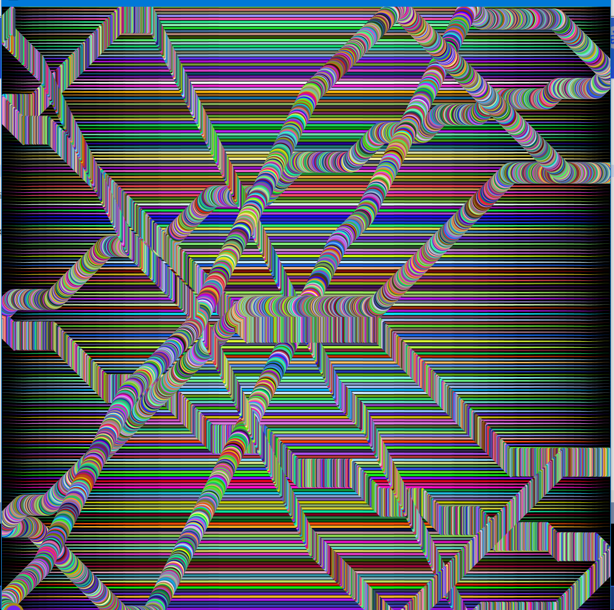

# Sept13 Homework Documentation

### The process

This homework started somewhat slowly for me, because even though I have completely familiarized myself with the `while()` and `for()` loops in Processing, I had no idea what made a code an art. To find out, I have started to do some research on it. Before I started my reading, here were some of the questions I had in my head:
  - To be an art, does something have to be extremely aesthetic?
  - To be an art, does something have to have an intrinsic value?
  - To be an art, does it have to be incomprehensible?
  - How can a piece of code be an art?

I have seen a piece of urinal being presented as an artwork by Marcel Duchamp. If a simple urinal made in a factory can be an art, then perhaps a code can be an art. But how? Therefore, I have decided to read Marcel Duchamp's works to understand the reasoning behind. 

In his definitions, an artist is a mediumistic being. Duchamp states that "we must deny him (the artist) the state of consciousness on the esthetic plane about what he is doing or why he is doing it". In other words, to create an artwork, the artist must enter in this state of trance during which they can't and shouldn't explain themselves. As the artist is purely the medium, the artist's vision should be divorced of the spectator's judgement of the work. Throughout art history, the virtues of an artwork has been completely separate from the rationalized explanations of the artist. 

- An art could be extremely aesthetic, but it does not have to be. 
- An art could have an intrinsic value, but it does not have to have it. Mainly the spectators be the judge of this. 
- An art may or may not be comprehended. It is meant to be interpreted by the spectator. 
- A piece of code can be an art the same way a simple urinal can be a work of art. All that matters is that the coder must behave as an artist, free from all consciousness in this plane during their creative act.  

Therefore, to create this code-art, I have to fulfill my role as a medium. I should not have any rationalizations of this artwork, nor should it affect my final result. I know of the methods through which I will create this artwork (through Processing, with the use of `for` and `while` loops). So I should just strap in and start the process.  

During coding, I had no idea what I wanted to do. But as I knew I had to start somewhere, I started making some loops and making things look cool, but when I added a colorful background to the code, I kept going and added more features that made for some cool visual illusions. 

### Difficulties I have faced

Aside from the obvious difficulty I had initially regarding the definition of an art, I also had a difficulty as a programmer. As a programmer, I always seek to be efficient and concise. This trait common in most programmers has led me to struggle a lot when left completely to my own device. The instructions mentioned nothing else but a simple art. What kind of an art? What should it look like? I started asking these questions from myself, and I really wished there were more instructions so I can just implement them. After just taking that first step by starting, though, I had just kept going until my artwork was completed. I have understood that even if I'm not really sure what to do or if I'm completely lost, just keeping at it could lead to some interesting outcomes. 

### Interesting Observations I have made

### References

- Duchamp, M. The Creative Act (1975). pp 138 - 140. 

### The screenshot of the program 

